# 4주차 스터디

## Controller 만들기
- 이전까지 Repository, Service 구현 완료
- 이번주 목표 : Controller 구현하기

### Like API
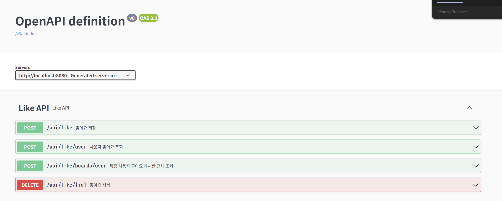

### Board API
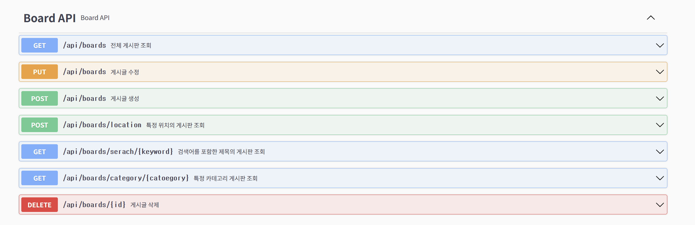

### User API
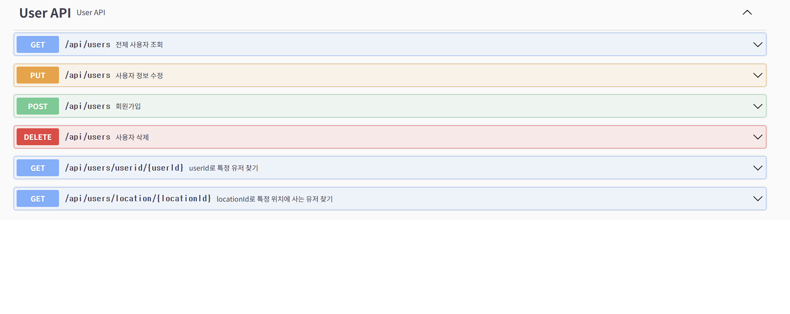

### Location API & DM API

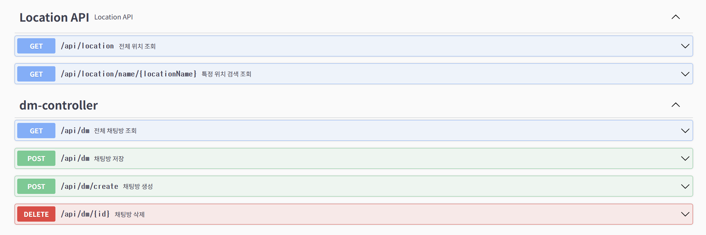

  

## Swagger 로 테스트
### - 전체 게시판 조회 API 테스트
### - 필요한 모든 내용이 잘 출력 되는 것을 확인!!!

> 데이터가 없어서 데이터는 안나오지만 필요한 내용과 타입이 제대로 명시 되었음을 확인

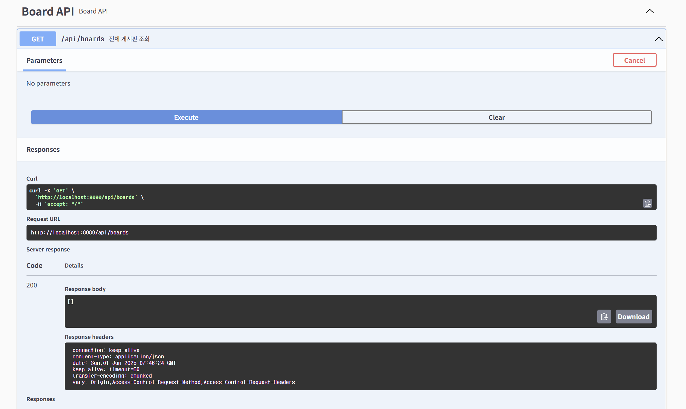

  

## Controller 작성 시 유의한 점
### - 이번 프로젝트 관통에서 각 API 마다 try-catch 를 사용하지 않아 특정 상황에 에러가 발생하는 경우가 많았다.
### - 이번에는 try-catch 를 통해 어떤 상황에서도 에러가 발생하지 않도록 조절

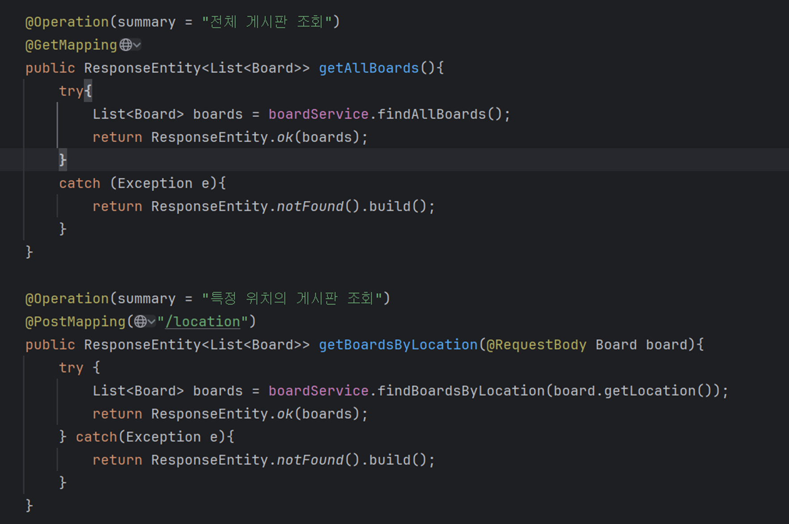

  

## Global Error
### - 항상 try-catch를 사용하는 것이 아니라 공통으로 사용하는 Error 가 있다면 Error 를 Custom으로 관리하여 에러 관리

> 강사님께서 말씀하신 "은행권은 처리 할 에러가 수백개가 넘는다" 가 이걸 말씀하신 듯 하다..

### 1. RuntimeException 을 상속받는 UserNotFoundException 을 생성

### 2. 에러 정보를 담을 ErrorResponse 생성 
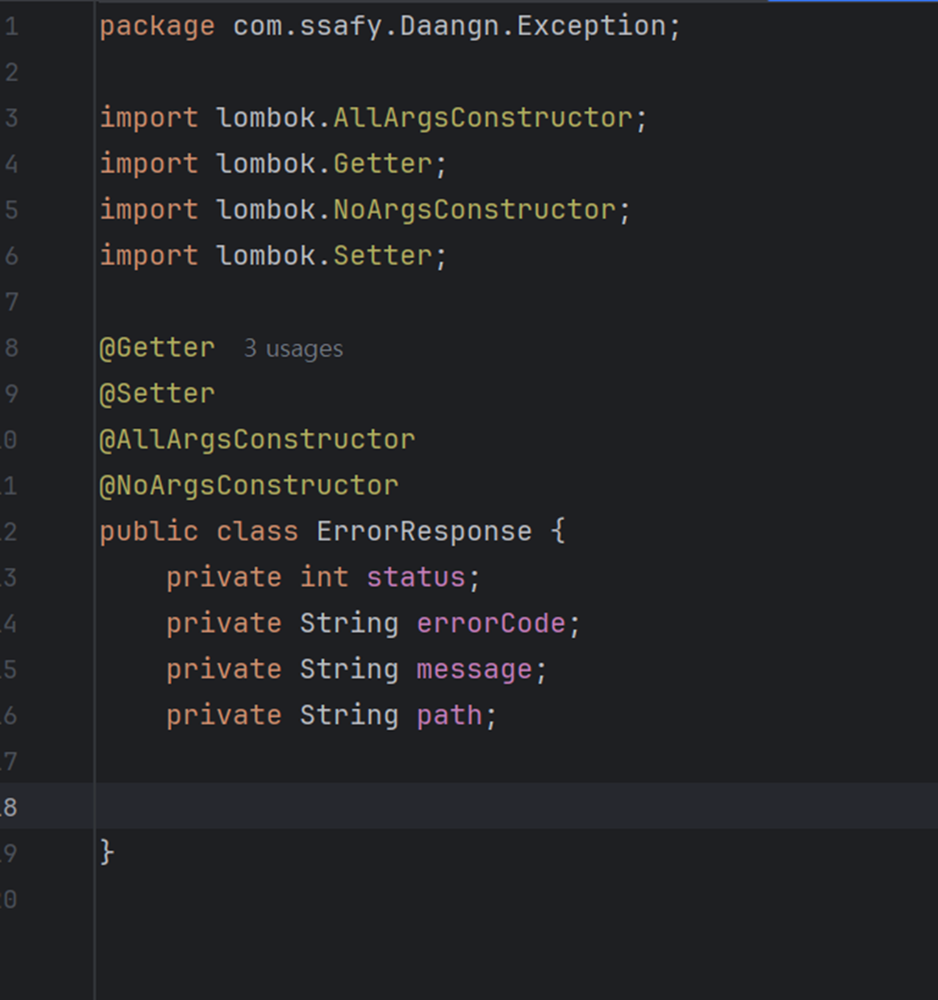

### 3. 에러를 전역으로 관리하기 위해 GlobalExceptionHandler 생성성
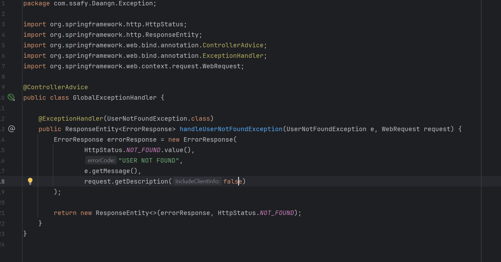

  

### 실제 에러 처리
### Before
#### - 별다른 에러 처리 없이 Service 구현
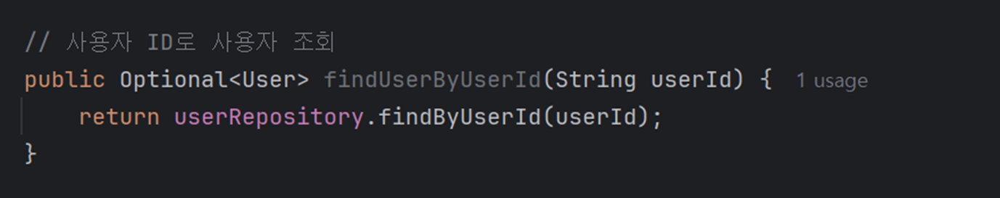

### After
#### - 제작한 에러로 처리
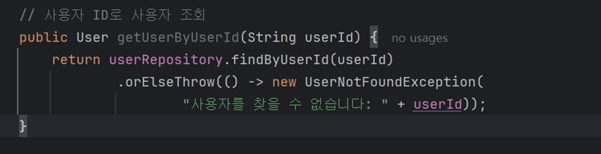

  

### Controller 에서도 Service에서 에러 처리를 해주기 때문에 try-catch 사용 XX
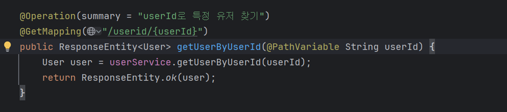

  

### 실제로 에러를 발생시켰을 때 결과 확인
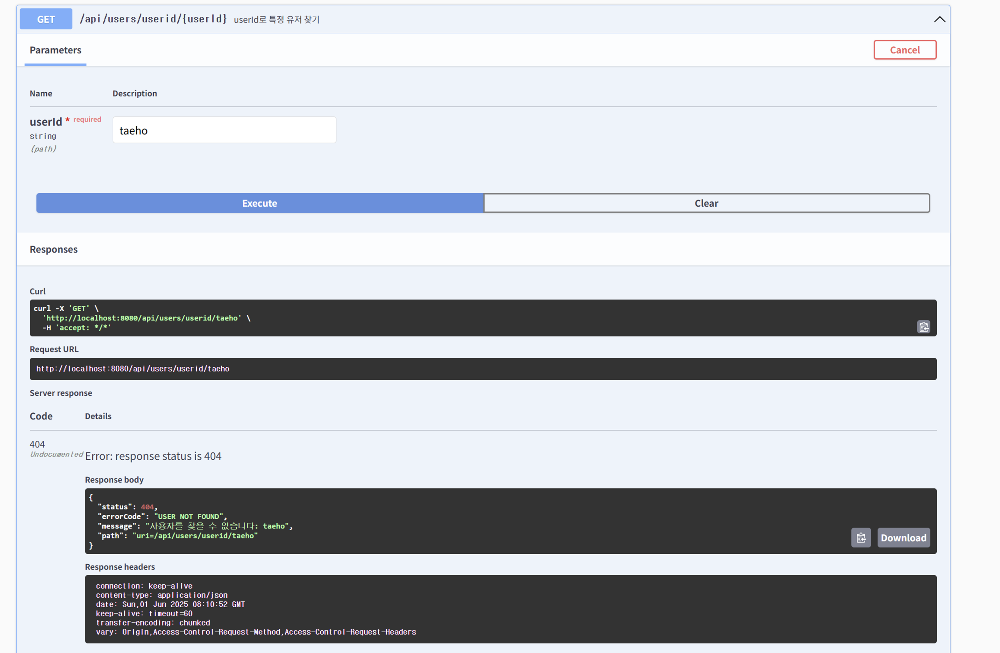