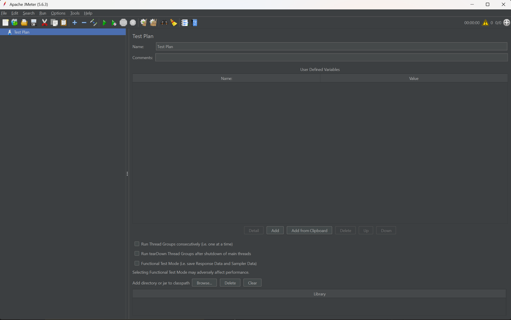
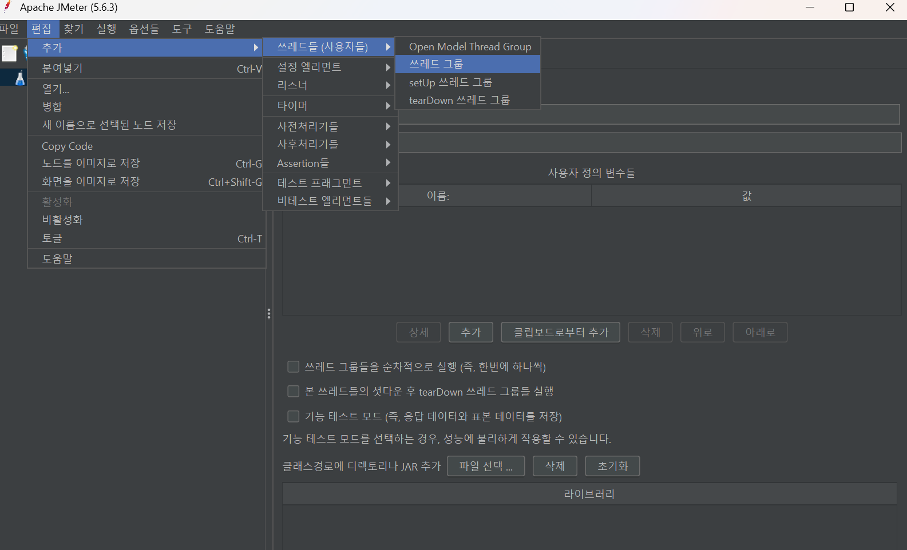
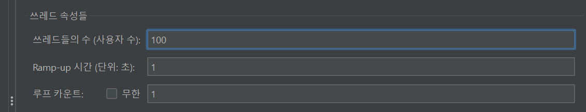
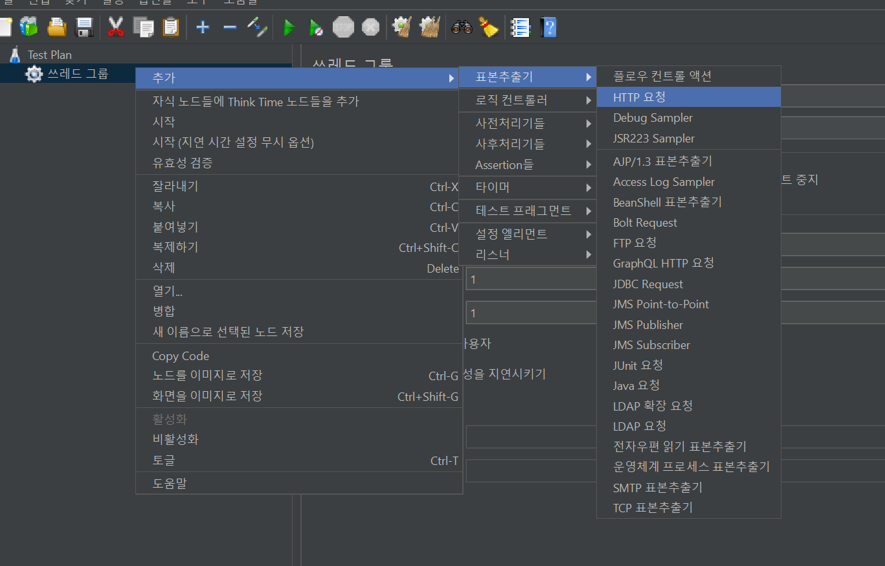
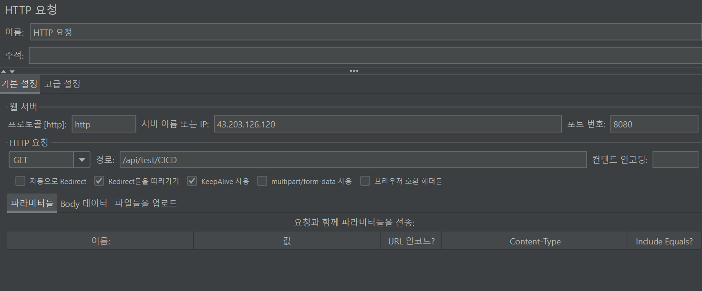
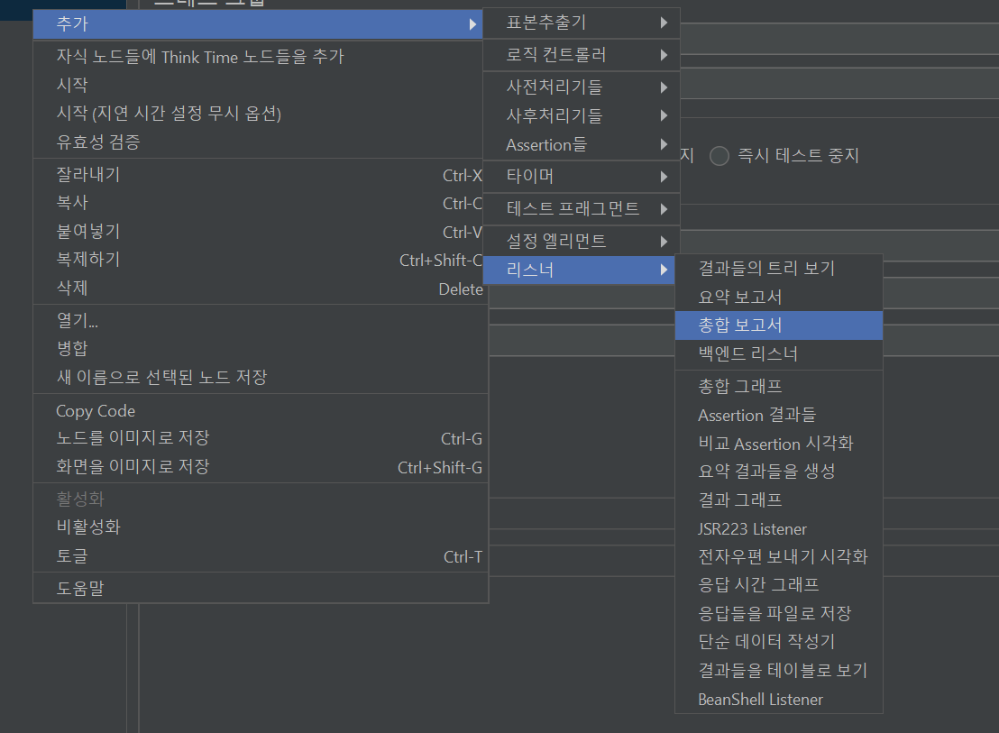
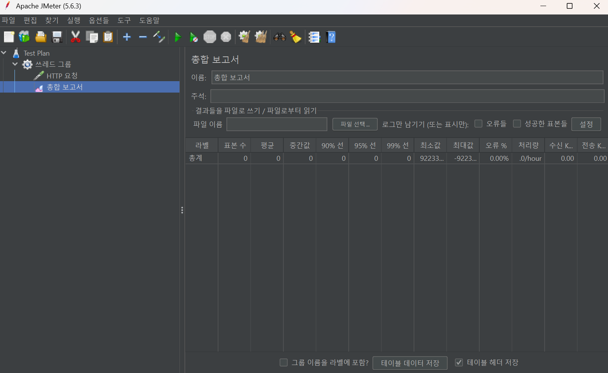
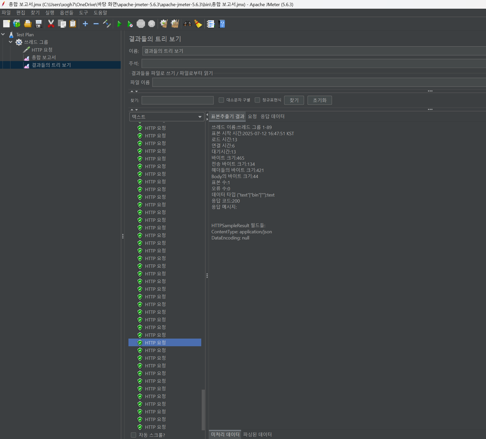
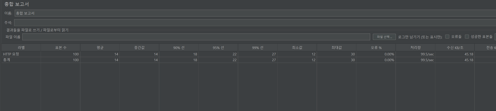

# 8주차 스터디
## 부하테스트
### Jmeter를 활용한 웹 어플리케이션 성능 테스트

 
 

### 부하 테스트란?
: 시스템이 얼마나 많은 작업량과 사용자를 효과적으로 처리할 수 있는지 검증하는 성능 테스트의 한 종류

 

### 어떤걸 테스트 하는거야?
- 동시 접속자 처리 능력
- 대규모 데이터 처리 상황에서의 안정성
- 시스템 확장성

 

### Jmeter란?
: Apache Software Foundation 에서 개발한 오픈소스 부하 테스트 도구

### Jmeter를 사용하는 이유?
- 다양한 프로토콜 지원 : HTTP, HTTPS, JDBC, REST API, TCP 등 다양한 프로토콜 테스트
- GUI, CLI 가능
- 분산 테스트 가능 : 여러 대의 머신 사용 = 대규모 부하 테스트 가능
- 확장성
- 무료 오픈소스

 

#### 단점은?
- 대규모 테스트 시 많은 메모리 소모
- 고급 기능 사용이 어렵다
- 단일 머신에서 생성할 수 있는 동시 사용자 수에 제한

BUT, 중소규모 프로젝트나 API 테스트, 웹 서비스 성능 테스트로 매유 효과적!

 

### 직접 실습해보자
#### 1. 설치 및 실행

#### 2. Thread Group 생성
: Thread Group = 가상으로 요청을 보내는 사용자 수 설정

- 쓰레드 수 = 사용자 수
- Rame-up 시간 : 초당 요청 횟수 = 1초당 요청 횟수
- 루프 카운트 : 반복 횟수

#### 3. HTTP 요청
: Sampler ( 가상의 Request ) 생성

#### 4. 리스너 생성
: Listener = 결과 확인

#### 5. 결과 확인

### 테스트 성공!

### DB랑 데이터를 주고받는 API로 테스트를 해보면 어떤 방식이 더 효율적인지 알 수 있겠네!